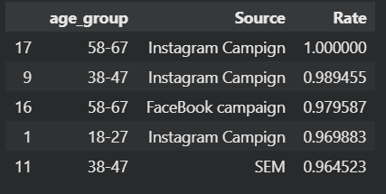

# Desafio de Estágio em Dados -  Itaú Unibanco

## Desenvolvedor: Lucca Machado da Silva

## Perguntas Iniciais

### Quais os produtos mais vendidos considerando os últimos 3 anos?

A imagem a seguir exibe a distribuição de vendas nos últimos 3 anos, considerando a data de 30 de maio de 2021. É possível observar que os dois produtos mais vendidos foram livros e roupas, praticamente empatando em quantidade, seguidos de eletrônicos e produtos para casa, também com quantidades muito similares.

### Qual o produto mais caro e o mais barato?

Não existe uma categoria com um produto mais caro ou mais barato em comparação com as outras. Em todas as categorias, o mesmo padrão se repete: o produto mais barato tem o preço de 10 e o mais caro, o preço de 500.

### Qual a categoria de produto mais vendida e a menos vendida? Qual a categoria mais cara e menos cara?

A categoria mais vendida foi a de roupas e a menos vendida foi a de produtos caseiros.

Através da análise da mediana de preços de produtos por categoria, é possível observar uma variação extremamente baixa, onde os produtos mais caros se encontram no setor de produtos para casa e os mais baratos em roupas e eletrônicos, que possuem a mesma mediana.

### Qual o produto com melhor e pior NPS ?

Os produtos com melhor NPS médio são da categoria home, e os com piores NPS são da categoria de eletrônicos.

## Resolução do Desafio

Para responder ao desafio "Analisando a base de dados, qual o tipo de público (considerando gênero e idade) e o canal ideal para vender determinado tipo de produto?", a principal tática adotada foi a análise exploratória dos dados em conjunto com a análise de variância (ANOVA).

Pensando na melhor solução possível, não se pode levar em consideração apenas os dados de gênero, idade, fonte e categoria de produto, pois o valor gasto também é um fator extremamente importante. Portanto, foram utilizadas as colunas 'Product Category', 'Customer Age', 'Gender', 'Source' e 'Total Purchase Amount' para responder ao desafio.

Somado a isso, foram propostas quatro hipóteses norteadoras para a resolução do desafio:

### Hipótese 1: Diferença no Total_Purchase_Amount entre os gêneros

- **Hipótese nula:** Não existe diferença significativa no Total_Purchase_Amount entre os gêneros.
- **Hipótese alternativa:** Existe diferença significativa no Total_Purchase_Amount entre os gêneros.

### Hipótese 2: Diferença no Total_Purchase_Amount entre as diferentes fontes

- **Hipótese nula:** Não existe diferença significativa no Total_Purchase_Amount entre as diferentes fontes.
- **Hipótese alternativa:** Existe diferença significativa no Total_Purchase_Amount entre as diferentes fontes.

### Hipótese 3: Diferença no Total_Purchase_Amount entre as diferentes faixas etárias

- **Hipótese nula:** Não existe diferença significativa no Total_Purchase_Amount entre as diferentes faixas etárias.
- **Hipótese alternativa:** Existe diferença significativa no Total_Purchase_Amount entre as diferentes faixas etárias.

### Hipótese 4: Grupo ideal para venda de um produto específico

- **Hipótese nula:** Não existe um grupo que forneça o melhor valor de venda possível em relação aos outros.
- **Hipótese alternativa:** Existe um grupo que forneça o maior valor de venda possível em relação aos outros.

**Abordagem para a Quarta Hipótese:** Para testar esta hipótese, agrupamos os dados por faixa etária e origem, somamos a quantidade total de compras pertencentes a cada grupo e extraímos a mediana do valor total gasto por esse grupo.

## Roteiro de Análise para Todas as Categorias

- Separar os tipos de produtos em conjuntos de dados diferentes para análise individual.
- Utilização da tabela ANOVA (Análise de Variância) e dos p-values para aceitar as hipóteses nulas ou alternativas.
- Verificar os resultados da tabela ANOVA através dos dados de cada tipo de produto.
- Agrupar as vendas de cada tipo de produto por origem e grupo etário, extraindo a mediana de Total_Purchase_Amount gasto.
- Após o agrupamento, realizar a multiplicação da mediana de Total_Purchase_Amount por Source_Count, ou seja, obter o valor mediano gasto por aquele grupo (considerando grupo etário e origem).
- Utilizar esta nova variável obtida como indicador da mediana do valor total gasto por um determinado grupo, obtendo assim os melhores grupos para vender uma categoria de produto.

## Análise das Hipóteses 1, 2 e 3 para Todas as Categorias de Produtos

A fim de determinar se a hipótese nula ou alternativa seria aceita para as quatro diferentes categorias de produtos, foi utilizada a tabela ANOVA.

    

        <h4>ANOVA para categoria clothing</h4>
        
    

    

        <h4>ANOVA para categoria eletronics</h4>
        
    

    

        <h4>ANOVA para categoria home</h4>
        
    

        

        <h4>ANOVA para catagoria books</h4>
        
    

As tabelas acima exibem o grau de significância de variação entre a variável Total_Purchase_Amount e as variáveis de Gênero, Source e age_group para os diferentes tipos de categoria de produto. Para que uma variável tenha um efeito significativo em Total_Purchase_Amount, é necessário que seu p-value seja menor que 0.05, e quanto menor esse valor, maior seu efeito. Através disso, é possível observar que o gênero e o Source não têm efeitos significativos em Total_Purchase_Amount para todas as categorias de produto, sendo assim, podemos assumir as hipóteses nulas sobre as hipóteses 1 e 2 para todas as categorias de produto, tendo em vista que seus p-values são altos. De maneira similar, é possível observar que para todas as categorias de produtos o age_group possui um p-value extremamente baixo, indicando que devemos aceitar a hipótese alternativa para todas as categorias de produtos, que indica que o grupo etário influencia diretamente no valor gasto total em uma compra.

As tabelas abaixo exibem as medianas de Total_Purchase_Amount por gênero para cada categoria de produto, confirmando a aceitação da hipótese nula para a hipótese 1, ou seja, não existe influência significativa do gênero no valor total gasto em cada compra.

 

    

        <h5>Clothing</h5>
        
    

    

        <h4>Eletronics</h4>
        
    

    

        <h4>Home</h4>
        
    

        

        <h4>Books</h4>
        
    

As tabelas abaixo exibem as medianas de Total_Purchase_Amount por Source para cada categoria de produto, confirmando a aceitação da hipótese nula para a hipótese 2, ou seja, não existe influência significativa do Source no valor total gasto em cada compra.

 

    

        <h5>Clothing</h5>
        
    

    

        <h4>Eletronics</h4>
        
    

    

        <h4>Home</h4>
        
    

        

        <h4>Books</h4>
        
    

As tabelas abaixo exibem as medianas de Total_Purchase_Amount por grupo etário para cada categoria de produto, confirmando a aceitação da hipótese alternativa para a hipótese 3, ou seja, o grupo etário tem uma influência significativa no valor total gasto em cada compra.

  

    

        <h5>Clothing</h5>
        
    

    

        <h4>Eletronics</h4>
        
    

    

        <h4>Home</h4>
        
    

        

        <h4>Books</h4>
        
    

## Análise da Hipótese 4 para Todas as Categorias de Produtos

Através das análises das outras hipóteses, sabe-se que o gênero não tem um impacto significativo no valor total gasto em cada compra. Portanto, as compras de ambos os gêneros foram agregadas em grupos. A ideia principal foi agrupar compras em que os compradores possuíam a mesma faixa etária e a mesma origem de compra, obtendo a mediana do Total_Purchase_Amount nesse processo e contando quantas compras se encaixavam nesse critério. Desta maneira, foi possível obter tabelas similares ao exemplo abaixo para cada uma das categorias de produto. Assim, é possível observar a quantidade total de compras que pessoas de um determinado grupo etário realizaram em uma determinada fonte de compra para uma categoria de produto, e, além disso, saber a mediana do valor total da compra de todas essas pessoas.

Após isso, uma nova coluna chamada 'Rate' é calculada através da multiplicação do 'Source_Count' (quantidade de compras daquele grupo) pelo Total_Purchase_Amount a fim de obter a mediana de gasto total daquele grupo como uma estimativa do melhor grupo para vender. A tabela abaixo representa a mudança após a realização da multiplicação; é possível observar que os valores são muito altos, o que dificulta a visualização dos melhores grupos, além da tabela não estar ordenada.

Após esse processo de obtenção da estimativa dos melhores grupos, foi realizada a análise de variância novamente para todos os grupos a fim de verificar se a origem de compra (Source) ou o grupo etário (age_group) tem um efeito significativo no valor total mediano por grupo.

    

        <h4>ANOVA para categoria clothing RATE</h4>
        
    

    

        <h4>ANOVA para categoria eletronics RATE</h4>
        
    

    

        <h4>ANOVA para categoria home RATE</h4>
        
    

        

        <h4>ANOVA para catagoria books RATE</h4>
        
    

Através das tabelas ANOVA acima, é possível perceber que ambas as variáveis, origem de compra (Source) e grupo etário (age_group), apresentam um p-valor muito abaixo de 0,05. Ou seja, ambas têm um efeito muito significativo no valor total mediano de compra. Dessa maneira, podemos aceitar a hipótese alternativa para a hipótese número quatro: existe algum grupo que se destaca entre os outros no valor total mediano de compra.

## Conclusões Finais e Análise do Cenário

Através da análise das quatro hipóteses, notamos que o gênero e o Source possuem uma baixa influência no valor total de cada compra, enquanto o grupo etário é extremamente relevante. Entretanto, após a extração de um valor mediano de gasto dos grupos, nota-se que o Source afeta sim o valor total mediano gasto. Isso ocorre porque a segunda hipótese analisa apenas o valor mediano individual de cada Source, sem considerar que alguns Sources possuem uma taxa de venda maior. Ao realizarmos a multiplicação de ambos os fatores, é evidente que o Source impacta no valor total gerado, apesar de não implicar em um valor de compra diferente para cada Source.

### Sendo assim, chega-se à conclusão final de que existem grupos (considerando faixa etária e Source) mais favoráveis para a venda de cada tipo de produto.

As tabelas e gráficos abaixo demonstram os melhores grupos para cada categoria de produto.

### Livros 

A tabela abaixo exibe os top 5 melhores compradores da categoria livros, considerando um valor total de compra mediano. O valor rate foi normalizado através do algoritmo MinMaxScaling.

    

        <h4>Tabela dos melhores compradores de books</h4>
        
    

    

        <h4>Gráfico dos melhores compradores de books</h4>
        
    

### Eletronicos

A tabela abaixo exibe os top 5 melhores compradores da categoria eletrônicos, considerando um valor total de compra mediano. O valor rate foi normalizado através do algoritmo MinMaxScaling.

    

        <h4>Tabela dos melhores compradores de livros</h4>
        
    

    

        <h4>Gráfico dos melhores compradores de livros</h4>
        
    

### Home

A tabela abaixo exibe os top 5 melhores compradores da categoria home, considerando um valor total de compra mediano. O valor rate foi normalizado através do algoritmo MinMaxScaling.

    

        <h4>Tabela dos melhores compradores de livros</h4>
        
    

    

        <h4>Gráfico dos melhores compradores de livros</h4>
        
    

### Clothing

A tabela abaixo exibe os top 5 melhores compradores da categoria clothing, considerando um valor total de compra mediano. O valor rate foi normalizado através do algoritmo MinMaxScaling.

    

        <h4>Tabela dos melhores compradores de livros</h4>
        
    

    

        <h4>Gráfico dos melhores compradores de livros</h4>
        
    

## Bibliotecas utilizadas

- Pandas
- Seaborn
- statsmodels
- sklearn